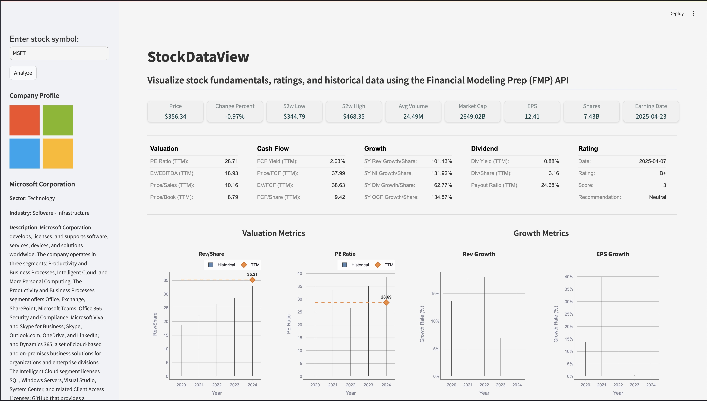

# StockDataView

StockDataView is a Streamlit application designed to display and visualize stock data fetched from the Financial Modeling Prep (FMP) API. It provides users with bar charts, tables of stock fundamentals, and ratings for a given stock ticker.

## Features
* **Stock Data Visualization:** Presents stock data in clear and interactive bar charts.
* **Fundamental Data Tables:** Displays key stock fundamentals in easy-to-read tables.
* **Stock Ratings:** Shows ratings information for selected stocks.
* **Containerized Application:** Easily deployable via Docker.
* **API Key Input:** Requires users to provide their FMP API key for data retrieval.
* **Automated CI/CD:** Uses GitHub Actions for continuous integration and deployment.
* **Package Management:** Uses `uv` and `pyproject.toml` for dependency management.
* **Makefile Automation:** Includes a Makefile for streamlined development and deployment workflows.

## Prerequisites
- **Docker**: Required to build and run the application container
- **FMP API Key**: Obtain a free or paid API key from [Financial Modeling Prep](https://financialmodelingprep.com/developer/docs/)
- **Git**: To clone the repository (optional)

## Installation

### Option 1: Use the Pre-Built Image
1. **Pull the Image from Docker Hub**:
   ```bash
   docker pull skytics/stockdataview:latest
   ```

2. **Run the Container**:
    * Replace `your-api-key` with your FMP API key:
   ```bash
   docker run -p 8501:8501 -e FMP_API_KEY=your-api-key skytics/stockdataview:latest
   ```

3. Open `http://localhost:8501` in your browser


### Option 2: Build and Run Locally
1. **Clone the Repository**:
   ```bash
   git clone https://github.com/your-username/StockDataView.git
   cd StockDataView
   ```

2. **Build the Production Image**:
   ```bash
   make docker-build-prod
   ```
    * This builds only the `production` stage of the multi-stage Dockerfile

3. **Run the Container**:
    * Replace `your-api-key` with your FMP API key:
   ```bash
   docker run -p 8501:8501 -e FMP_API_KEY=your-api-key skytics/stockdataview:latest
   ```

4. Open `http://localhost:8501` in your browser


## Usage
* Once the app is running, enter a stock ticker (e.g., AAPL) in the Streamlit interface.
* View the displayed bar charts, tables, stock fundamentals, and ratings fetched from the FMP API.


## Development

### Package Management (uv)
* This project uses `uv` for package management. Dependencies are defined in `pyproject.toml`.
* Sync dependencies from `pyproject.toml`.

To install dependencies:

```bash
uv sync
```

### Makefile Commands
* `make docker-build-prod`: Build the production image
* `make docker-run`: Run the production image
* `make docker-build-dev`: Build the dev image (for linting/testing)
* `make docker-check`: Run linting in the dev image
* `make docker-test`: Run tests in the dev image
* `make docker-clean`: Remove all images

### Multi-Stage Dockerfile
* `builder` stage: Used for development (linting, testing)
* `production` stage: Final app image for running StockDataView


## CI/CD Workflow
* GitHub Actions automates building the `production` image and pushing it to Docker Hub (`skytics/stockdataview:latest`) on `main` branch updates
* The `builder` stage is used for linting and testing in CI
* See `.github/workflows/ci-cd.yml` for details


## Data Source

StockDataView project utilizes data from the free tier of the Financial Modeling Prep (FMP) API. Due to the limitations of the free plan, the primary focus is on **US-listed stocks**. Data for international markets and more advanced features may not be available in this version.

**Limitations due to Free FMP API Plan:**

* **Data Coverage:** Primarily focused on US stock market data.
* **Historical Data:** Limited historical data availability (typically up to 5 years for most endpoints).
* **Real-time Data:** Data may be end-of-day or delayed real-time.
* **API Call Limits:** Functionality might be limited by the daily API call restrictions of the free plan.

**Potential Future Enhancements:**

With access to a paid FMP API plan, future versions of this dashboard could include:

* Support for international stock markets.
* Access to more extensive historical data.
* Real-time data updates.
* Integration of additional financial data and features.


## Contributing
Contributions are welcome! Please feel free to submit a pull request.

## License
This project is licensed under the MIT License - see the `LICENSE` file for details.